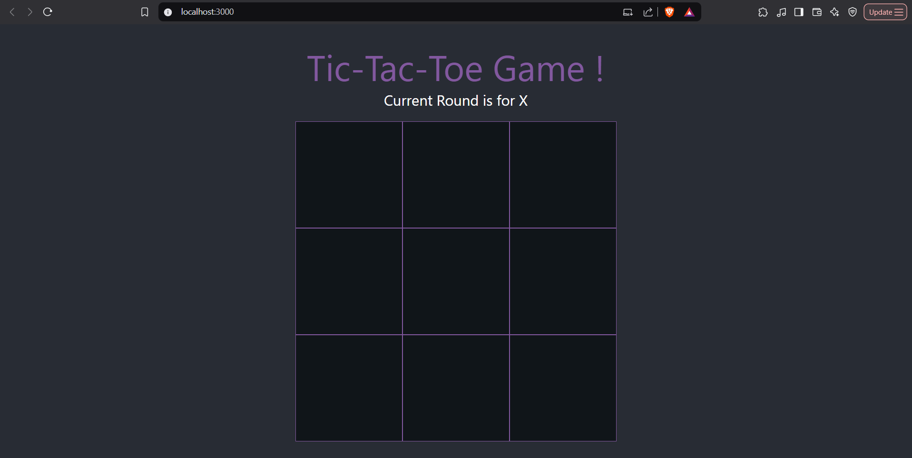
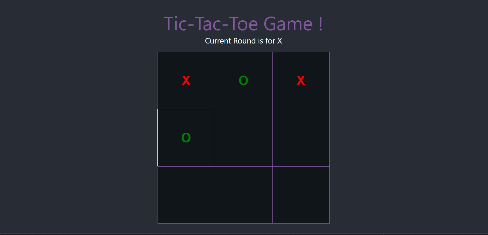
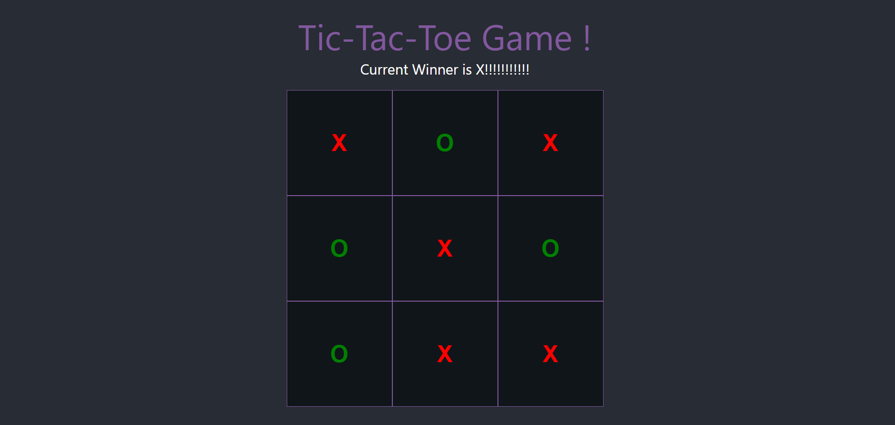

# Getting Started with Tic-Tac-Toe

<p align="center">
  <a href="" rel="noopener">
    


</p>
<p align="center">
    <br> 
</p>
<div align="center">

[](https://github.com/hamdy-cufe-eng/Tic-Tac-Toe/contributors)
[](https://github.com/hamdy-cufe-eng/Tic-Tac-Toe/issues)
[](https://github.com/hamdy-cufe-eng/Tic-Tac-Toe/network)
[](https://github.com/hamdy-cufe-eng/Tic-Tac-Toe/stargazers)
[](https://github.com/hamdy-cufe-eng/Tic-Tac-Toe/blob/main/LICENSE)

</div>

<details>
  <summary>Table of Contents</summary>
  <ol>
    <li>
      <a href="#about">About The Project</a>
      <ul>
        <li><a href="#tech">Built Using</a></li>
      </ul>
    </li>
    <li>
      <a href="#install">Getting Started</a>
      <ul>
        <li><a href="#install">Installation</a></li>
      </ul>
    </li>
    <li><a href="#screenshots">Screenshots</a></li>
	<li><a href="#contributors">Contributors</a></li>
  </ol>
</details>


## About

 Advanced Tic-Tac-Toe made in react with a flat ui design .

## 💻 Built Using <a name = "tech"></a>
* )


## 🏁 Get Started /Usage <a name = "install"></a>
1. **Clone the repository**
```
git clone https://github.com/hamdy-cufe-eng/Tic-Tac-Toe.git
```
2. **Install Visual Studio Code**


3. **Open the folder in IDE**


### `npm start`

Runs the app in the development mode.\
Open [http://localhost:3000](http://localhost:3000) to view it in your browser.

The page will reload when you make changes.\
You may also see any lint errors in the console.

## 📷 Screenshots <a name = "screenshots" ></a>

<div name="Screenshots" align="center">
   
   <hr>
    
    <hr>
  
   
   <hr>
</div>

## Contributors <a name = "contributors"></a>
<table align="center">
  <tr>
    <td align="center">
    <a href="https://github.com/hamdy-cufe-eng" target="_black">
    
    <br />
    <sub><b>Hamdy Ahmed</b></sub></a>
    </td>
    
  </tr>
 </table>


